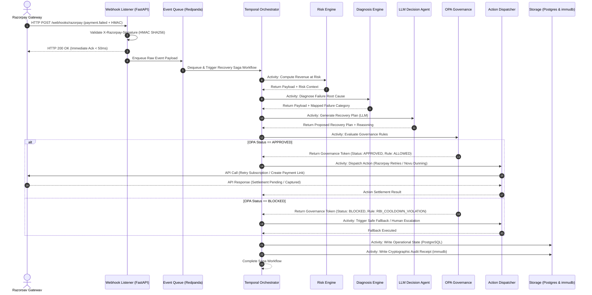

# Data Flow Specification: AI Revenue Recovery Agent
**Project:** Razorpay AI Buildathon (Track 3)  
**Document ID:** `docs/04-data-flow.md`  
**Status:** Approved Architectural Baseline  

---

## Executive Summary

This document specifies the exact lifecycle and payload evolution of a payment failure event as it traverses the **AI Revenue Recovery Agent** pipeline. Through 7 distinct processing phases, raw Razorpay webhook payloads are progressively enriched with financial risk scores, diagnostic classifications, AI-driven intervention plans, OPA compliance tokens, execution status, and cryptographic audit proofs.

---

## 1. Pipeline Overview & Data Enrichment Principle

The system operates on an additive payload transformation pipeline. As an event transitions across architectural perimeters, state is never mutated in place; instead, standardized metadata objects are appended to the event envelope.

```
┌──────────────────────────────────────────────────────────────────────────┐
│                      PAYLOAD ENRICHMENT PIPELINE                         │
├──────────────────────────────────────────────────────────────────────────┤
│ Raw Webhook Payload                                                      │
│ └── + [Risk Context]           (Immediate & LTV Revenue at Risk)         │
│     └── + [Diagnostic Data]    (Granular Root Cause Category)            │
│         └── + [AI Proposal]    (Channel, Timing, Dunning Message)        │
│             └── + [OPA Token]  (Regulatory & Merchant Rule Verification) │
│                 └── + [Execution Result] (Razorpay Settlement ID)        │
│                     └── + [Audit Hash]   (Cryptographic Proof in immudb) │
└──────────────────────────────────────────────────────────────────────────┘
```

---

## 2. End-to-End Data Flow Sequence Diagram

The following sequence diagram traces the complete synchronous and asynchronous interaction flow across system components:



---

## 3. Step-by-Step Payload Evolution (The 7 Phases)

### Phase 1: Ingestion (Raw Webhook Payload)
The FastAPI Webhook Listener receives the raw JSON event payload dispatched by Razorpay upon a recurring subscription payment failure.

```json
{
  "event_id": "evt_01J8A9X4K2M3N4P5Q6R7S8T9U0",
  "event": "payment.failed",
  "contains": ["payment", "subscription"],
  "created_at": 1724180400,
  "payload": {
    "payment": {
      "entity": {
        "id": "pay_PZ182x9A7kL3mQ",
        "amount": 299900,
        "currency": "INR",
        "status": "failed",
        "order_id": "order_PZ177a8B9cD0eF",
        "invoice_id": "inv_PZ166x1Y2z3A4B",
        "international": false,
        "method": "card",
        "card_id": "card_PZ155m6N7o8P9Q",
        "bank": "HDFC",
        "error_code": "BAD_REQUEST_ERROR",
        "error_description": "Payment failed due to insufficient funds in customer account",
        "error_source": "issuing_bank",
        "error_step": "payment_authorization",
        "error_reason": "insufficient_funds"
      }
    },
    "subscription": {
      "entity": {
        "id": "sub_PZ100s1T2u3V4W",
        "plan_id": "plan_PZ099a8B7c6D5E",
        "customer_id": "cust_PZ088x9Y0z1A2B",
        "status": "active",
        "current_start": 1724180400,
        "current_end": 1726858800,
        "charge_at": 1724180400,
        "paid_count": 5,
        "remaining_count": 7
      }
    }
  }
}
```

---

### Phase 2: Risk Calculation (Risk Engine Enrichment)
The Risk Engine extracts financial context, calculates immediate and customer lifetime value at risk, and appends the `risk_context` block.

```json
{
  "event_id": "evt_01J8A9X4K2M3N4P5Q6R7S8T9U0",
  "payment_id": "pay_PZ182x9A7kL3mQ",
  "subscription_id": "sub_PZ100s1T2u3V4W",
  "customer_id": "cust_PZ088x9Y0z1A2B",
  "risk_context": {
    "immediate_amount_inr": 2999.00,
    "remaining_tenure_months": 7,
    "estimated_remaining_ltv_inr": 20993.00,
    "total_revenue_at_risk_inr": 23992.00,
    "historical_payment_success_rate": 1.0,
    "priority_score": 0.89
  }
}
```

---

### Phase 3: Diagnosis (Error Taxonomy Mapping)
The Diagnosis Engine analyzes raw decline codes (`BAD_REQUEST_ERROR` + `insufficient_funds`) and attaches a standardized diagnostic category and liquidity timing prediction.

```json
{
  "event_id": "evt_01J8A9X4K2M3N4P5Q6R7S8T9U0",
  "payment_id": "pay_PZ182x9A7kL3mQ",
  "risk_context": { "total_revenue_at_risk_inr": 23992.00 },
  "diagnosis": {
    "error_category": "LIQUIDITY_FRICTION",
    "decline_code": "INSUFFICIENT_FUNDS",
    "is_hard_decline": false,
    "suggested_retry_delay_hours": 72,
    "payday_window_detected": true,
    "target_retry_timestamp": 1724439600
  }
}
```

---

### Phase 4: AI Decision (LLM Proposal Generation)
The LLM Decision Agent analyzes subscriber history, preferred channel, and diagnostic data to construct a structured `proposed_action`.

```json
{
  "event_id": "evt_01J8A9X4K2M3N4P5Q6R7S8T9U0",
  "diagnosis": { "error_category": "LIQUIDITY_FRICTION" },
  "proposed_action": {
    "action_type": "SCHEDULED_RETRY_WITH_DUNNING",
    "scheduled_execution_time": 1724439600,
    "retry_attempt_number": 1,
    "channel": "WHATSAPP",
    "template_id": "tpl_payday_grace_hinglish_v2",
    "dunning_payload": {
      "language": "hinglish",
      "message_text": "Namaste Sharmaji! Aapka Premium Subscription auto-debit attempt balance kam hone ki wajah se complete nahi ho paya. Humne retry 23 Aug ko schedule kiya hai. Aap yahan click karke direct pay kar sakte hain: https://rzp.io/i/rec_demo123"
    },
    "llm_reasoning": "Subscriber failed due to NSF on 20th. Historical salary credit pattern indicates replenishment on 22nd-23rd. High LTV subscriber ($23,992 RaR) warrants WhatsApp gentle dunning in Hinglish prior to retry."
  }
}
```

---

### Phase 5: Governance Check (OPA Policy Evaluation)
The Proposed Action payload is dispatched to the Open Policy Agent. OPA evaluates RBI pre-debit rules and merchant velocity limits, appending `governance_status`.

```json
{
  "event_id": "evt_01J8A9X4K2M3N4P5Q6R7S8T9U0",
  "proposed_action": { "action_type": "SCHEDULED_RETRY_WITH_DUNNING" },
  "governance": {
    "status": "APPROVED",
    "evaluator": "OPA_v1.4.2",
    "evaluated_at": 1724180405,
    "applied_rules": [
      "rule_rbi_predebit_notice_24h_pass",
      "rule_cooldown_window_48h_pass",
      "rule_merchant_max_retries_pass"
    ],
    "policy_hash": "a8f9c0d1e2f3a4b5c6d7e8f9a0b1c2d3e4f5a6b7c8d9e0f1a2b3c4d5e6f7a8b9",
    "verification_token": "tok_opa_APPROVED_987654321"
  }
}
```

---

### Phase 6: Execution (Action Dispatch & Gateway Settlement)
Upon OPA approval, the Action Dispatcher executes the scheduled retry or payment link creation via Razorpay and Novu APIs.

```json
{
  "event_id": "evt_01J8A9X4K2M3N4P5Q6R7S8T9U0",
  "governance": { "status": "APPROVED" },
  "execution_result": {
    "execution_id": "exec_8832a7b1-4c9f-4e12",
    "executed_at": 1724439610,
    "razorpay_api_response": {
      "status_code": 200,
      "razorpay_payment_id": "pay_PZ999_RECOVERED",
      "settlement_status": "captured",
      "recovered_amount_inr": 2999.00
    },
    "notification_dispatch": {
      "channel": "WHATSAPP",
      "novu_message_id": "msg_nov_44556677",
      "delivery_status": "delivered"
    }
  }
}
```

---

### Phase 7: Audit (Cryptographic Ledgering & State Commit)
The fully enriched payload is cryptographically hashed and committed to `immudb` for non-repudiable auditability, while operational state is updated in PostgreSQL.

```json
{
  "audit_trail": {
    "transaction_id": "txn_rec_01J8A9X4K2M3N4P5",
    "event_id": "evt_01J8A9X4K2M3N4P5Q6R7S8T9U0",
    "subscription_id": "sub_PZ100s1T2u3V4W",
    "recovered_amount_inr": 2999.00,
    "recovery_status": "RECOVERED",
    "payload_sha256": "e3b0c44298fc1c149afbf4c8996fb92427ae41e4649b934ca495991b7852b855",
    "immudb_tx_id": 4820194,
    "immudb_tree_root_hash": "7f83b1657ff1fc53b92dc18148a1d65dfc2d4b1fa3d677284addd200126d9069",
    "committed_at": 1724439612
  }
}
```

---

## 4. Error Handling & Edge Case Workflows

```
┌──────────────────────────────────────────────────────────────────────────┐
│                       EXCEPTION & FALLBACK ROUTES                        │
├──────────────────────────────────┬───────────────────────────────────────┤
│ Exception Condition              │ System Fallback Action                │
├──────────────────────────────────┼───────────────────────────────────────┤
│ LLM Timeout (> 3000ms)           │ Deterministic Rules Engine Fallback   │
│ LLM Malformed JSON Output        │ Schema Validation Failure ──► Fallback│
│ OPA Policy BLOCKED               │ Halt Automated Action ──► Escalation  │
│ Gateway API Execution 5xx        │ Temporal Exponential Backoff Retry    │
└──────────────────────────────────┴───────────────────────────────────────┘
```

### 4.1 LLM Timeout or Malformed Response
* **Trigger:** LLM Decision Agent fails to return a response within $3000\text{ms}$ or returns unparseable/invalid JSON failing Pydantic schema validation.
* **Handling:**
  1. Langfuse records an execution anomaly trace.
  2. Temporal catches the activity exception and redirects execution to the **Deterministic Safety Fallback Activity**.
  3. The fallback activity applies a pre-configured, static retry schedule (e.g., standard 48-hour retry without aggressive messaging) and forwards the fallback plan to OPA.

### 4.2 OPA Policy BLOCKED (Governance Violation)
* **Trigger:** OPA returns `governance.status = "BLOCKED"` due to an RBI pre-debit notice violation, excessive retry attempts, or invalid merchant discount bounds.
* **Handling:**
  1. The automated recovery path is aborted instantly. Zero calls are made to Razorpay execution APIs.
  2. The payload status is updated to `GOVERNANCE_BLOCKED`.
  3. An alert is pushed to the React Finance Dashboard's **Escalation & Compliance Review Queue** for manual review by a Finance Controller.
  4. The blocked event and exact OPA policy rejection rationale are committed to `immudb` to preserve complete audit lineage.

---

## 5. Document Metadata & Sign-off

* **Author:** Fintech System Architect / Track 3 Engineering Team  
* **Target Buildathon:** Razorpay AI Buildathon — Track 3 (AI Revenue Recovery)  
* **Upstream Specification:** `docs/01-problem-statement.md`, `docs/02-solution-overview.md`, `docs/03-system-architecture.md`  
* **Implementation Artifacts:** `docs/04-data-flow.md`  
