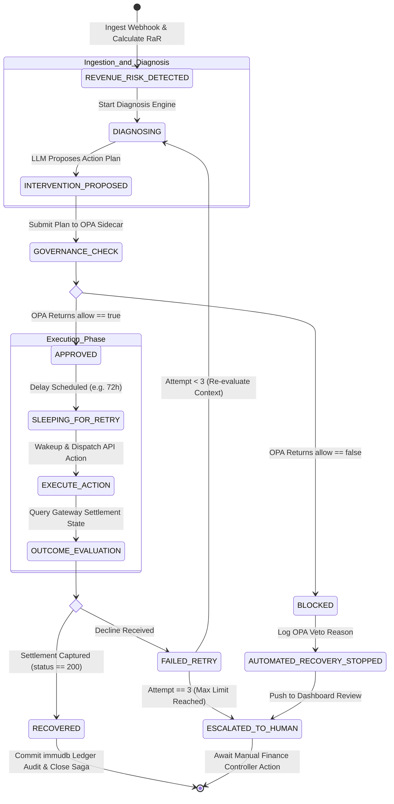

# Recovery Workflows & Durable Saga Orchestration
**Project:** Razorpay AI Buildathon (Track 3)  
**Document ID:** `docs/10-recovery-workflows.md`  
**Status:** Approved Architectural Baseline  

---

## Executive Summary

This document specifies the durable execution layer of the **AI Revenue Recovery Agent** powered by **Temporal.io**. Replacing fragile, polling-based cron jobs, Temporal manages the multi-day "Recovery Saga" for failed subscription payments as state-machine workflows. By decoupling state persistence from execution workers, the system achieves $O(1)$ space complexity during long sleep windows (e.g., waiting 48–72 hours for payday replenishment or RBI pre-debit notice windows) and guarantees fault-tolerant recovery across infrastructure failures.

---

## 1. Overview & The End of Cron Jobs

Traditional payment recovery engines rely on database polling scripts or cron jobs (e.g., `cron.daily` scanning `subscriptions` tables). This legacy approach exhibits four critical failure modes:

```
┌──────────────────────────────────────────────────────────────────────────┐
│                       CRON ENGINE VS. TEMPORAL SAGA                      │
├───────────────────────────────┬──────────────────────────────────────────┤
│ Legacy Cron Engine            │ Temporal Durable Saga                    │
├───────────────────────────────┼──────────────────────────────────────────┤
│ O(N^2) DB table polling scans │ Event-triggered O(1) workflow start      │
│ In-memory state loss on crash │ Event-history replay guarantees state    │
│ Fixed 24h interval retries    │ Dynamic, payday-aligned timers           │
│ Resource-heavy worker polling │ Zero RAM usage during sleep (O(1) Space) │
└───────────────────────────────┴──────────────────────────────────────────┘
```

### The Principle of Durable Execution
When the AI Revenue Recovery Agent decides to delay a payment retry by 72 hours (e.g., aligning with customer salary credit on the 23rd of the month):
1. **Zero RAM Footprint:** Temporal persists the workflow's execution event history to disk/database and unloads the workflow instance from worker memory.
2. **Durable Timers:** A lightweight, durable timer is registered in Temporal's persistence cluster. Execution worker nodes consume zero CPU or RAM during the 72-hour sleep period.
3. **Crash Recovery Guarantee:** If the backend worker server crashes or restarts on hour 36, Temporal automatically restores the exact workflow state on a new worker and wakes up the saga at hour 72.000 to execute the next activity.

---

## 2. Recovery Case State Machine

The complete lifecycle of a payment recovery saga is governed by the following deterministic state machine:



---

## 3. Workflow vs. Activities Architecture

To ensure strict determinism, Temporal separates workflow code from activity code:

```
┌──────────────────────────────────────────────────────────────────────────┐
│                   WORKFLOW VS. ACTIVITY BOUNDARIES                       │
├───────────────────────────────────┬──────────────────────────────────────┤
│ RecoverySagaWorkflow              │ Discrete Activities                  │
├───────────────────────────────────┼──────────────────────────────────────┤
│ • 100% Deterministic control flow │ • Non-deterministic side effects     │
│ • State transitions & timers      │ • Outbound REST API calls (Razorpay) │
│ • Zero direct network or DB calls │ • LLM inference queries (OpenAI)     │
│ • Orchestrates activity calls     │ • OPA HTTP sidecar checks            │
│ • Handles business branch logic   │ • PostgreSQL & immudb database writes│
└───────────────────────────────────┴──────────────────────────────────────┘
```

### 3.1 The RecoverySaga Workflow
* **Function:** Coordinates the sequence of operations from initial failure detection to final settlement audit.
* **Determinism Rule:** Workflow code must never execute direct HTTP requests, generate random numbers, or call system clocks (`datetime.now()`). All non-deterministic operations are encapsulated within Activities.

### 3.2 Discrete Activities Directory
1. `ComputeRevenueAtRiskActivity`: Calculates immediate $\text{RaR}$ and risk tier.
2. `DiagnoseRootCauseActivity`: Executes error mapping taxonomy.
3. `GenerateAIInterventionActivity`: Wraps LLM inference and records Langfuse trace.
4. `EvaluateOPAGovernanceActivity`: Queries OPA sidecar for compliance token.
5. `DispatchRazorpayActionActivity`: Calls Razorpay APIs (Invoices Retry / Payment Links).
6. `DispatchNovuNotificationActivity`: Sends WhatsApp / SMS / Email dunning.
7. `CommitImmudbLedgerActivity`: Appends SHA-256 payload hash and verification token to `immudb`.

---

## 4. Time & State Management (The Sleep Pattern)

When an intervention requires a delayed retry or must observe an RBI cooldown period, the workflow invokes Temporal's durable timer primitive:

```python
# Conceptual Temporal Workflow Sleep Logic
async def run_recovery_saga(self, input_payload: dict) -> dict:
    # Phase 1-4: Risk, Diagnosis, AI, Governance
    plan = await workflow.execute_activity(
        GenerateAIInterventionActivity, 
        input_payload
    )
    
    governance = await workflow.execute_activity(
        EvaluateOPAGovernanceActivity, 
        plan
    )
    
    if not governance["approved"]:
        return await self.handle_governance_block(governance)
        
    # Durable Sleep (O(1) Space Complexity)
    if plan["retry_delay_hours"] > 0:
        await workflow.sleep(timedelta(hours=plan["retry_delay_hours"]))
        
    # Execute Action post-wakeup
    result = await workflow.execute_activity(
        DispatchRazorpayActionActivity, 
        plan
    )
    return result
```

### What Happens Under the Hood During `workflow.sleep`
1. Temporal records a `TimerStarted` event in the workflow history.
2. The workflow execution thread yields, and the worker drops the in-memory state.
3. The Temporal Cluster timer service schedules a wakeup callback at $T_{\text{start}} + \text{delay}$.
4. Upon expiration, Temporal schedules a `FireTimer` task, assigning a worker to resume the workflow from line 22 (`DispatchRazorpayActionActivity`).

---

## 5. Error Handling: System vs. Business Failures

The orchestration layer explicitly categorizes failures to apply the correct recovery strategy:

```
┌──────────────────────────────────────────────────────────────────────────┐
│                         ERROR HANDLING STRATEGY                          │
├──────────────────────────────────┬───────────────────────────────────────┤
│ Failure Category                 │ Handling Strategy                     │
├──────────────────────────────────┼───────────────────────────────────────┤
│ System Failure (Network/5xx)     │ Automatic Activity Exponential Retry  │
│ Business Failure (Decline/Veto)  │ Workflow State Transition (No Retry)  │
└──────────────────────────────────┴───────────────────────────────────────┘
```

### 5.1 System Failures (Automatic Activity Retries)
* **Triggers:** Network socket timeouts, HTTP `503 Service Unavailable` from OpenAI/Razorpay, database connection drops.
* **Handling:** Temporal automatically retries the failing *Activity* based on its declared `RetryPolicy` without advancing or failing the parent workflow.
* **Activity Retry Policy Configuration:**
  ```python
  from temporalio.common import RetryPolicy
  
  SYSTEM_ACTIVITY_RETRY_POLICY = RetryPolicy(
      initial_interval=timedelta(seconds=2),
      backoff_coefficient=2.0,
      maximum_interval=timedelta(seconds=60),
      maximum_attempts=5,
      non_retryable_error_types=["InvalidCredentialsError", "OPA_VETO_ERROR"]
  )
  ```

### 5.2 Business Failures (State Machine Transitions)
* **Triggers:** OPA policy veto (`approved: false`), card declined due to `INSUFFICIENT_FUNDS`, customer explicitly cancels mandate.
* **Handling:** These are valid business outcomes, not system faults. The Activity returns a structured response indicating the business failure. The Workflow catches the output and branches state (e.g., transitioning to `GOVERNANCE_BLOCKED` or scheduling the next attempt). The Activity itself is **not** retried.

---

## 6. Document Metadata & Sign-off

* **Author:** Fintech System Architect / Track 3 Engineering Team  
* **Target Buildathon:** Razorpay AI Buildathon — Track 3 (AI Revenue Recovery)  
* **Upstream Specification:** `docs/01-problem-statement.md`, `docs/03-system-architecture.md`, `docs/04-data-flow.md`, `docs/09-governance-and-policies.md`  
* **Implementation Artifacts:** `docs/10-recovery-workflows.md`  
